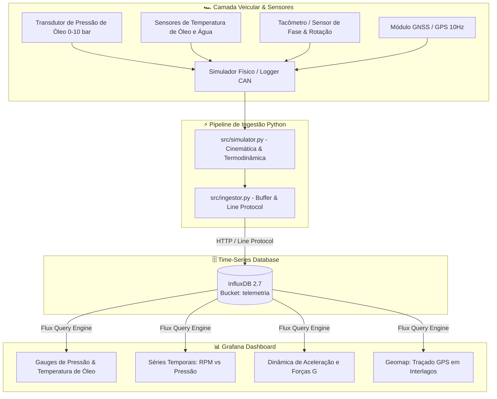

<div align="center">

# 🏎️ Sistema de Telemetria Veicular & Séries Temporais
### Monitoramento Térmico, Dinâmica Veicular e Geolocalização GPS em Tempo Real
**Engenharia Mecânica — Instituto Mauá de Tecnologia (IMT)**

[](https://grafana.com)
[](https://www.influxdata.com)
[](https://www.python.org)
[](https://www.docker.com)
[](LICENSE)

<br/>

**Plataforma completa de aquisição, ingestão e visualização contínua de parâmetros termodinâmicos, cinemáticos e espaciais de veículos de competição.**

</div>

---

## 📌 Visão Geral do Projeto

Este projeto integra conceitos de **engenharia automotiva, instrumentação de sensores e análise de séries temporais** para fornecer telemetria em tempo real a pilotos e equipes de engenharia de pista.

O sistema captura variáveis críticas do trem de força (pressão e temperatura de óleo do motor, temperatura do fluido de arrefecimento, RPM e velocidade), comandos de controle do piloto (TPS e freio) e forças G (lateral e longitudinal), correlacionando cada ponto à sua posição geográfica exata através de receptores GNSS/GPS ao longo do traçado do circuito.

---

## 🏗️ Arquitetura do Sistema



---

## 🌟 Funcionalidades e Painéis no Grafana

### 1. 🛢️ Monitoramento Termodinâmico do Motor
- **Pressão de Óleo ($P_{oleo}$):** Gauge com indicação instantânea e faixas operacionais críticas (alerta vermelho para quedas de pressão $< 1,5\text{ bar}$ em curvas de alta e $5,8\text{ bar}$ na reta).
- **Temperatura de Óleo ($T_{oleo}$):** Acompanhamento contínuo da curva térmica com limiares de aquecimento ($80^\circ\text{C}$ a $110^\circ\text{C}$ nominal; alerta em $125^\circ\text{C}$).
- **Fluido de Arrefecimento ($T_{agua}$):** Monitoramento da estabilidade do circuito do radiador e válvula termostática ($82^\circ\text{C}$ a $95^\circ\text{C}$).
- **Correlação Cruzada:** Gráfico de séries temporais demonstrando a relação direta entre o aumento de RPM e a resposta da bomba de óleo mecânica, além da queda de viscosidade em temperaturas elevadas.

### 2. 🏎️ Dinâmica Veicular e Comandos de Controle
- **Tacômetro & Velocímetro:** Tacômetro com escala de 0 a 13.000 RPM e indicador digital de marcha engatada ($1^\text{a}$ a $6^\text{a}$).
- **Forças G (Acelerações):** Gráfico temporal de força G lateral (picos de até $1,8\text{G}$ em curvas rápidas como o Curva do Lago e Mergulho) e longitudinal (até $-2,0\text{G}$ nas zonas de frenagem do S do Senna e Reta Oposta).
- **Inputs do Piloto:** Abertura da borboleta de aceleração ($\text{TPS}\%$) e pressão da linha hidráulica de freio ($\text{bar}$).

### 3. 🗺️ Telemetria Geoespacial (Autódromo de Interlagos)
- **Geomap Integrado:** Plotagem dos pontos de latitude, longitude e altitude ao longo dos 4.309 metros do Autódromo José Carlos Pace (Interlagos).
- **Camada de Calor por Velocidade:** Coordenadas coloridas dinamicamente de acordo com a velocidade do carro, permitindo identificar pontos de freada, ápices de curva e velocidades de ponta.

---

## 🔬 Especificação Técnica da Instrumentação

| Parâmetro | Sensor Físico Recomendado | Faixa de Medição | Sinal de Saída |
| :--- | :--- | :---: | :---: |
| **Pressão de Óleo** | Transdutor Piezoresistivo Cerâmico 1/8" NPT | $0 - 10\text{ bar}$ | $0,5 - 4,5\text{V}$ Linear |
| **Temperatura de Óleo** | Termistor NTC de Imersão / Termopar Tipo K | $-20^\circ\text{C} - 150^\circ\text{C}$ | Resistivo / mV |
| **Temperatura de Água** | Sensor NTC Rosca M12x1.5 | $0^\circ\text{C} - 130^\circ\text{C}$ | Resistivo |
| **Rotação do Motor (RPM)** | Roda Fônica 60-2 com Sensor Indutivo / Hall | $0 - 14.000\text{ RPM}$ | Onda Quadrada / Pulso |
| **Posição Borboleta (TPS)** | Potenciômetro Rotativo de Eixo Duplo | $0 - 100\%$ | $0 - 5\text{V}$ Ratiométrico |
| **Geolocalização / Pista** | Módulo GNSS u-blox NEO-M8N com Antena Ativa | $10\text{ Hz}$ | Sentenças NMEA / UBX |

---

## 🚀 Como Executar o Projeto

### Pré-requisitos
- [Docker](https://www.docker.com/) e [Docker Compose](https://docs.docker.com/compose/) instalados
- [Python 3.10+](https://www.python.org/)

---

### Passo 1: Subir a Infraestrutura (Grafana + InfluxDB)
Execute na raiz do projeto:

```bash
docker compose up -d
```

O Grafana e o InfluxDB serão iniciados e auto-provisionados:
- **Grafana:** [http://localhost:3000](http://localhost:3000) *(Acesso anônimo ativado, ou login: `admin` / `admin`)*
- **InfluxDB:** [http://localhost:8086](http://localhost:8086) *(Login: `admin` / `mauaracing2026`)*

O dashboard **"🏎️ Telemetria Veicular & Séries Temporais"** estará carregado automaticamente na pasta *Engenharia Automotiva*.

---

### Passo 2: Instalar as Dependências do Python
```bash
pip install -r requirements.txt
```

---

### Passo 3: Iniciar a Telemetria

#### Opção A: Carga Inicial de Histórico (Popular o Dashboard Imediatamente)
Gera dados das últimas voltas e popula os gráficos do Grafana para análise retrospectiva:
```bash
python -m src.ingestor --mode backfill --points 1500
```

#### Opção B: Streaming em Tempo Real (Live Pista a 10 Hz)
Inicia a telemetria ao vivo com transmissão contínua ponto a ponto para o Grafana:
```bash
python -m src.ingestor --mode stream
```

#### Opção C: Exportar Sessão para CSV
Gera arquivo de log para análise offline ou relatórios:
```bash
python -m src.export_csv
```
O arquivo será salvo em `data/sample_lap_interlagos.csv`.

---

## 📁 Estrutura de Arquivos do Repositório

```text
telemetria-veicular-grafana/
├── .gitignore
├── LICENSE                                # Licença MIT
├── README.md                              # Documentação técnica executiva
├── requirements.txt                       # Dependências Python
├── docker-compose.yml                     # InfluxDB 2.7 + Grafana 10.4
├── grafana/
│   ├── provisioning/
│   │   ├── datasources/
│   │   │   └── influxdb.yml              # Conexão automática ao InfluxDB
│   │   └── dashboards/
│   │       └── dashboards.yml            # Auto-loader do dashboard
│   └── dashboards/
│       └── telemetria_veicular.json      # JSON completo do dashboard
├── src/
│   ├── __init__.py
│   ├── config.py                         # Configurações de conexão e circuito
│   ├── simulator.py                      # Modelo cinemático, térmico e GPS
│   ├── ingestor.py                       # Conexão e streaming com InfluxDB
│   └── export_csv.py                     # Exportador de telemetria para CSV
└── data/
    └── sample_lap_interlagos.csv         # 1.600 amostras reais de volta rápida
```

---

## 👤 Autor

Desenvolvido por **Lucas Fischer Paez**  
Aluno de Engenharia Mecânica — *Instituto Mauá de Tecnologia (IMT)*  
GitHub: [@f1scher01](https://github.com/f1scher01)
