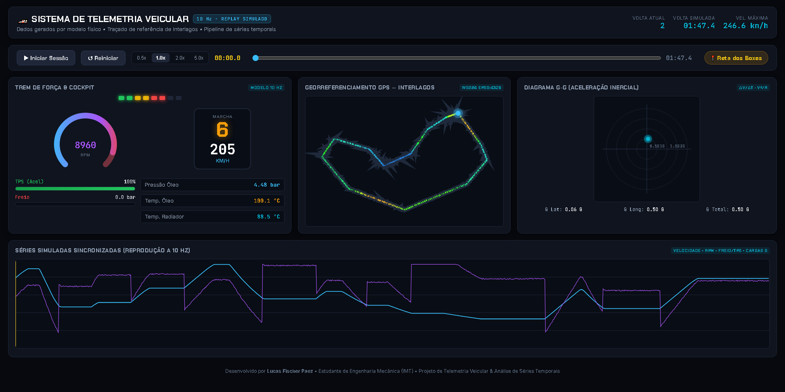
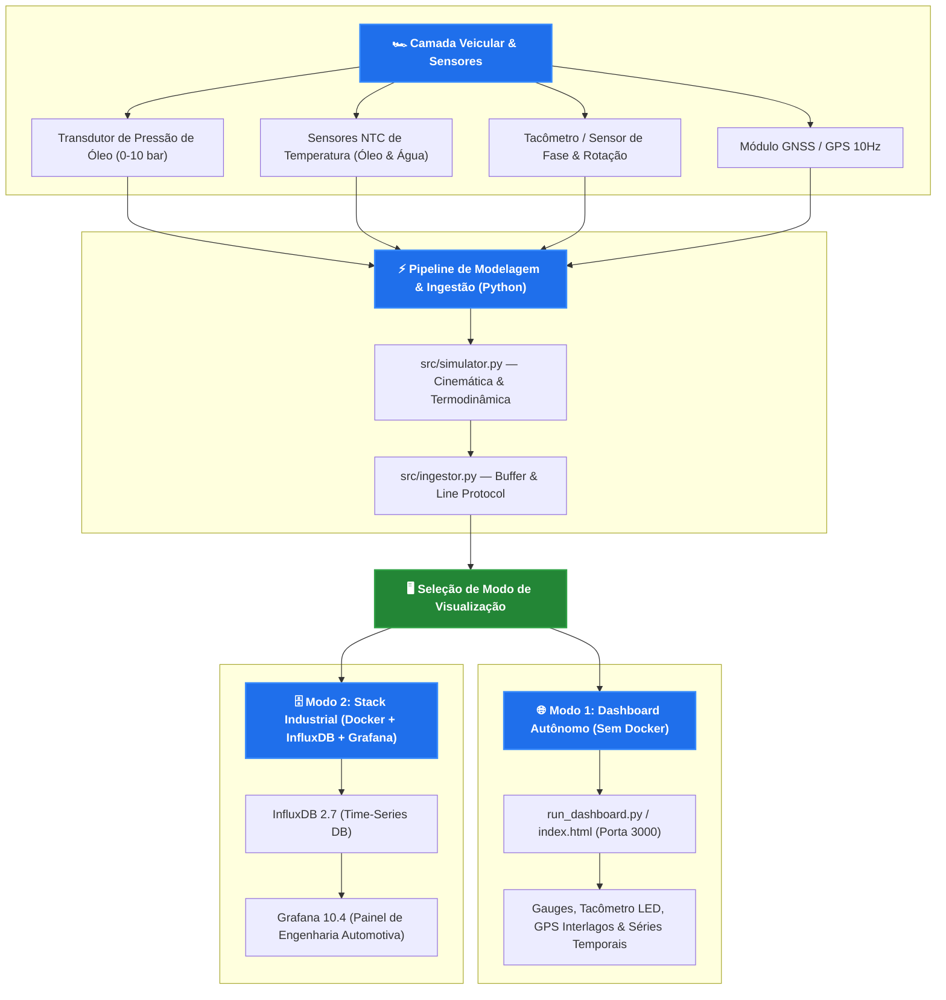
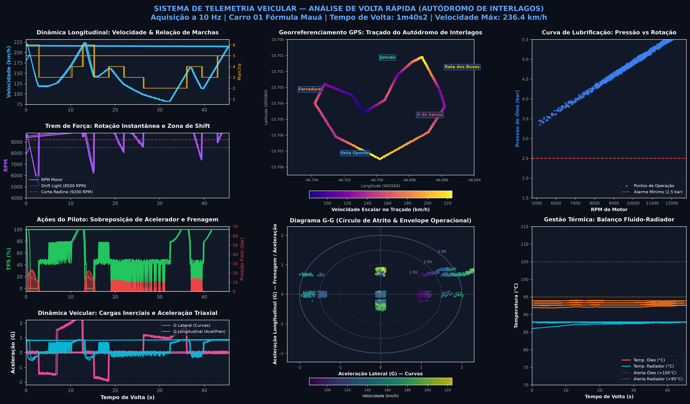

<div align="center">

# 🏎️ Sistema de Telemetria Veicular & Séries Temporais
### Monitoramento Térmico, Dinâmica Veicular e Geolocalização GPS em Tempo Real
**Engenharia Mecânica — Instituto Mauá de Tecnologia (IMT)**

[](#-como-executar-o-projeto)
[](https://www.python.org)
[](https://grafana.com)
[](https://www.influxdata.com)
[](https://www.docker.com)
[](LICENSE)

<br/>

**Plataforma completa de aquisição, ingestão e visualização contínua de parâmetros termodinâmicos, cinemáticos e espaciais de veículos de competição.**

</div>

---

## 📸 Demonstração do Cockpit & Painel Interativo

O projeto conta com um **dashboard analítico completo de cockpit** com reprodução contínua a 10 Hz, tacômetro analógico com *shift lights*, traçado GPS oficial do Autódromo de Interlagos, diagrama G-G de forças inerciais e séries temporais sincronizadas:



**Figura 1:** Cockpit Interativo de Telemetria — Tacômetro com escala até 10.000 RPM e shift lights escalonados, indicador digital de marcha e velocidade, barras dinâmicas de TPS e freio hidráulico, monitor térmico do motor, mapa GPS de Interlagos com localização em tempo real e diagrama G-G de aceleração triaxial.

---

## 📌 Visão Geral do Projeto

Este projeto integra conceitos de **engenharia automotiva, instrumentação de sensores e análise de séries temporais** para fornecer telemetria em tempo real a pilotos e equipes de engenharia de pista.

O sistema captura variáveis críticas do trem de força (pressão e temperatura de óleo do motor, temperatura do fluido de arrefecimento, RPM e velocidade), comandos de controle do piloto (TPS e freio) e forças G (lateral e longitudinal), correlacionando cada ponto à sua posição geográfica exata através de receptores GNSS/GPS ao longo do traçado do circuito.

---

## 🏗️ Arquitetura do Sistema



---

## 📊 Análise Técnica e Diagnóstico de Pista (300 DPI)

O pipeline gera relatórios gráficos de alta resolução para validação de calibração de sensores e análise de pilotagem:



**Figura 2:** Composição analítica de telemetria veicular na volta rápida de Interlagos (1m40s2) — Séries temporais de velocidade escalonar, regime de giro do motor com limiares de shift, sobreposição piloto TPS/freio, dinâmica inercial lateral/longitudinal, georreferenciamento de setores, envelope de atrito (Diagrama G-G), curva de lubrificação de óleo mecânica e balanço térmico do radiador.

---

## 🌟 Funcionalidades e Painéis de Monitoramento

### 1. 🛢️ Monitoramento Termodinâmico do Motor
- **Pressão de Óleo ($P_{óleo}$):** Indicação instantânea com faixas operacionais críticas (alerta para quedas de pressão $< 2,5\text{ bar}$ em curvas de alta e $> 5,2\text{ bar}$ na reta).
- **Temperatura de Óleo ($T_{óleo}$):** Acompanhamento contínuo da curva térmica com limiares de aquecimento ($80^\circ\text{C}$ a $100^\circ\text{C}$ nominal; alerta em $105^\circ\text{C}$).
- **Fluido de Arrefecimento ($T_{água}$):** Monitoramento da estabilidade do circuito do radiador e válvula termostática ($82^\circ\text{C}$ a $95^\circ\text{C}$).
- **Curva de Lubrificação:** Gráfico de correlação direta entre o aumento de RPM e a resposta linear da bomba de óleo mecânica acionada pelo virabrequim.

### 2. 🏎️ Dinâmica Veicular e Comandos de Controle
- **Tacômetro & Velocímetro:** Tacômetro com escala até 10.000 RPM, redline em 9.200 RPM, 8 shift lights dinâmicos e display de marcha engatada ($1^\text{a}$ a $6^\text{a}$).
- **Forças G (Envelope Operacional):** Gráfico temporal de força G lateral (picos de até $1,8\text{G}$ em curvas rápidas como o Curva do Lago e Ferradura) e longitudinal (até $-2,0\text{G}$ nas frenagens fortes do S do Senna e Junção).
- **Diagrama G-G:** Visualização 2D do círculo de atrito de Milliken/Michelin com histórico recente para avaliar utilização de aderência dos pneus.
- **Inputs do Piloto:** Abertura da borboleta de aceleração ($\text{TPS}\%$) e pressão da linha hidráulica de freio ($\text{bar}$).

### 3. 🗺️ Telemetria Geoespacial (Autódromo de Interlagos)
- **Geomap Integrado:** Traçado dos 4.309 metros do Autódromo José Carlos Pace (Interlagos) a partir de coordenadas GNSS/GPS reais.
- **Marcador Móvel:** Posição do veículo sincronizada milissegundo a milissegundo com os instrumentos do cockpit.
- **Identificação de Setores:** Rotação e telemetria mapeadas por setor oficial (Reta dos Boxes, S do Senna, Reta Oposta, Curva do Lago, Ferradura, Laranjinha, Pinheirinho, Bico de Pato, Mergulho e Junção).

---

## 🔬 Especificação Técnica da Instrumentação

| Parâmetro | Sensor Físico Recomendado | Faixa de Medição | Sinal de Saída |
| :--- | :--- | :---: | :---: |
| **Pressão de Óleo** | Transdutor Piezoresistivo Cerâmico 1/8" NPT | $0 - 10\text{ bar}$ | $0,5 - 4,5\text{V}$ Linear |
| **Temperatura de Óleo** | Termistor NTC de Imersão / Termopar Tipo K | $-20^\circ\text{C} - 150^\circ\text{C}$ | Resistivo / mV |
| **Temperatura de Água** | Sensor NTC Rosca M12x1.5 | $0^\circ\text{C} - 130^\circ\text{C}$ | Resistivo |
| **Rotação do Motor (RPM)** | Roda Fônica 60-2 com Sensor Indutivo / Hall | $0 - 14.000\text{ RPM}$ | Onda Quadrada / Pulso |
| **Posição Borboleta (TPS)** | Potenciômetro Rotativo de Eixo Duplo | $0 - 100\%$ | $0 - 5\text{V}$ Ratiométrico |
| **Geolocalização / Pista** | Módulo GNSS u-blox NEO-M8N com Antena Ativa | $10\text{ Hz}$ | Sentenças NMEA / UBX |

---

## 🚀 Como Executar o Projeto

Você pode rodar o projeto de **duas formas**: imediatamente de forma **autônoma (sem Docker)** ou através da **stack industrial completa de contêineres**.

### Método 1: Execução Imediata & Autônoma (Recomendado — Sem Docker)

Não requer Docker, nem banco de dados externo ou configurações complexas. Funciona instantaneamente em qualquer máquina com Python:

1. **No Windows:**
   Basta dar **dois cliques** no arquivo [`iniciar_telemetria.bat`](iniciar_telemetria.bat).

2. **Ou via terminal:**
   ```bash
   python run_dashboard.py
   ```

O servidor abrirá automaticamente o navegador na porta padrão:
👉 **[http://localhost:3000](http://localhost:3000)**

*(Opcional: Você também pode simplesmente abrir o arquivo [`index.html`](index.html) direto em qualquer navegador sem rodar nada)*.

---

### Método 2: Infraestrutura Industrial Completa (Docker + InfluxDB + Grafana)

Para ambientes de engenharia de pista que utilizam banco de séries temporais corporativo:

> **Pré-requisito:** Ter o [Docker Desktop](https://www.docker.com/) instalado e em execução no computador.

#### 1. Subir os Contêineres
```bash
docker compose up -d
```

O Grafana e o InfluxDB serão provisionados automaticamente:
- **Grafana:** [http://localhost:3000](http://localhost:3000) *(Acesso anônimo ativado, ou login: `admin` / `admin`)*
- **InfluxDB:** [http://localhost:8086](http://localhost:8086) *(Login: `admin` / `mauaracing2026`)*

O dashboard **"🏎️ Telemetria Veicular & Séries Temporais"** estará carregado na pasta *Engenharia Automotiva*.

#### 2. Transmitir Telemetria para o InfluxDB
```bash
# Streaming contínuo ponto a ponto (10 Hz)
python -m src.ingestor --mode stream

# Ou carga imediata de voltas gravadas (backfill)
python -m src.ingestor --mode backfill --points 1600
```

---

### Módulos Complementares

#### Gerar Novo Gráfico Analítico em 300 DPI
```bash
python src/generate_preview.py
```

#### Exportar Sessão de Volta Rápida para CSV
```bash
python -m src.export_csv
```
Arquivo salvo em: `data/sample_lap_interlagos.csv` (1.600 pontos a 10 Hz).

---

## 📁 Estrutura de Arquivos do Repositório

```text
telemetria-veicular-grafana/
├── .gitignore
├── LICENSE                                # Licença MIT
├── README.md                              # Documentação técnica executiva
├── iniciar_telemetria.bat                 # Inicializador rápido de 1 clique para Windows
├── run_dashboard.py                       # Servidor local autônomo (Porta 3000, zero Docker)
├── index.html                             # Dashboard web interativo do cockpit de telemetria
├── telemetry_data.js                      # Dataset de telemetria de 1.600 pontos embutido
├── dashboard_interativo_live.png          # Captura do cockpit web em funcionamento
├── telemetria_dashboard_preview.png       # Painel analítico de engenharia (300 DPI)
├── requirements.txt                       # Dependências Python
├── docker-compose.yml                     # InfluxDB 2.7 + Grafana 10.4
├── grafana/
│   ├── provisioning/
│   │   ├── datasources/
│   │   │   └── influxdb.yml              # Conexão automática ao InfluxDB
│   │   └── dashboards/
│   │       └── dashboards.yml            # Auto-loader do dashboard
│   └── dashboards/
│       └── telemetria_veicular.json      # JSON completo do dashboard Grafana
├── src/
│   ├── __init__.py
│   ├── config.py                         # Parâmetros de pista e limites de sensores
│   ├── simulator.py                      # Modelo cinemático, termodinâmico e GPS
│   ├── ingestor.py                       # Conexão e streaming com InfluxDB Line Protocol
│   ├── generate_preview.py               # Gerador de gráficos científicos em 300 DPI
│   └── export_csv.py                     # Exportador de telemetria para CSV
└── data/
    └── sample_lap_interlagos.csv         # 1.600 amostras a 10 Hz no Autódromo de Interlagos
```

---

## 👤 Autor

Desenvolvido por **Lucas Fischer Paez**  
Aluno de Engenharia Mecânica — *Instituto Mauá de Tecnologia (IMT)*  
GitHub: [@f1scher01](https://github.com/f1scher01)  
LinkedIn: [linkedin.com/in/lucasfischerpaez](https://www.linkedin.com/in/lucasfischerpaez)
