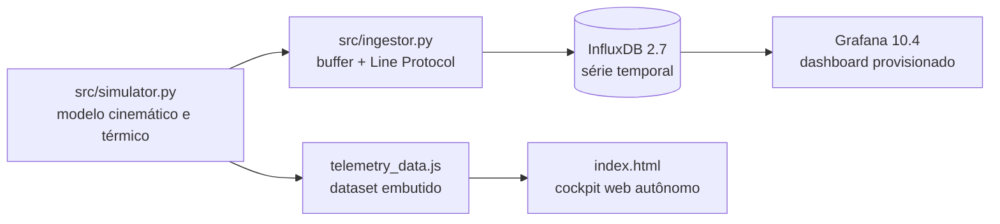

<div align="center">

# 🏎️ Simulador de Telemetria Veicular e Stack de Séries Temporais

### Modelagem física, pipeline de ingestão e observabilidade com InfluxDB e Grafana

[](https://fischerpaez.grafana.net/public-dashboards/5ea12a828dd1478eb54041c8624531d0)
[](https://www.influxdata.com)
[](https://www.docker.com)
[](#-aviso-a-telemetria-deste-projeto-é-simulada)

</div>

---

## ⚠️ Aviso: a telemetria deste projeto é simulada

**Não há veículo instrumentado, nem sensores físicos, nem volta gravada em pista.**

Todos os dados vêm de `src/simulator.py`, um modelo cinemático e termodinâmico que gera séries
sintéticas a 10 Hz sobre a geometria do traçado de Interlagos. Pressão de óleo, temperatura,
rotação, TPS, freio, forças G e posição GPS são **produto do modelo**, não de medição.

O que este repositório demonstra é a **engenharia em volta do dado**: modelagem física, geração
de séries temporais, ingestão via Line Protocol, persistência em banco de séries temporais,
provisionamento automatizado e visualização. O veículo é o pretexto; o pipeline é o projeto.

---

## O que é real e o que é simulado

| Camada | Componente | Status |
| :--- | :--- | :--- |
| Modelagem | Cinemática, termodinâmica e trajetória GPS (`src/simulator.py`) | **Código real, saída sintética** |
| Ingestão | Buffer e InfluxDB Line Protocol (`src/ingestor.py`) | **Real e funcional** |
| Persistência | InfluxDB 2.7 em contêiner | **Real** |
| Provisionamento | Datasource e dashboard automáticos (`grafana/provisioning/`) | **Real** |
| Visualização | Dashboard Grafana e cockpit web (`index.html`) | **Real** |
| Orquestração | `docker-compose.yml` | **Real** |
| Geometria da pista | Coordenadas do traçado de Interlagos | **Reais** (domínio público) |
| Valores dos sensores | Pressão, temperatura, RPM, G, TPS, freio | **Simulados** |
| Volta de 1m40s | Sessão de referência | **Sintética** |

---

## Demonstração


**Figura 1.** Cockpit web com tacômetro e *shift lights*, indicador de marcha e velocidade, barras
de TPS e freio, monitor térmico, mapa do traçado com marcador móvel e diagrama G-G. Reprodução
contínua a 10 Hz sobre a série simulada.


**Figura 2.** Composição analítica em 300 DPI: séries de velocidade e rotação com limiares de
troca, sobreposição TPS e freio, dinâmica inercial, envelope de atrito e balanço térmico.

---

## Modelo físico

O simulador percorre a poligonal do traçado e resolve, a cada passo:

- **Cinemática longitudinal.** Velocidade por setor, aceleração e desaceleração com limites de
  aderência, marcha engatada a partir da relação de transmissão e rotação resultante.
- **Dinâmica lateral.** Força G lateral a partir do raio de curvatura local e da velocidade,
  $a_{lat} = v^2 / R$, compondo com a longitudinal o envelope de atrito exibido no diagrama G-G.
- **Termodinâmica do motor.** Temperatura de óleo e de arrefecimento por resposta de primeira
  ordem à carga, com constante de tempo e assíntota distintas para cada circuito.
- **Lubrificação.** Pressão de óleo proporcional à rotação, representando a bomba mecânica
  acionada pelo virabrequim, com saturação na válvula de alívio.

---

## Especificação de instrumentação para uma versão física

Esta tabela **não descreve hardware existente**. É a especificação que eu usaria para substituir
o simulador por aquisição real, mantendo o restante do pipeline intacto.

| Grandeza | Sensor adequado | Faixa | Sinal |
| :--- | :--- | :---: | :---: |
| Pressão de óleo | Transdutor piezoresistivo 1/8" NPT | 0 – 10 bar | 0,5 – 4,5 V |
| Temperatura de óleo | Termistor NTC de imersão ou termopar tipo K | −20 a 150 °C | Resistivo / mV |
| Temperatura de água | NTC rosca M12×1,5 | 0 a 130 °C | Resistivo |
| Rotação | Roda fônica 60-2 com sensor indutivo ou Hall | 0 – 14.000 RPM | Onda quadrada |
| Posição de borboleta | Potenciômetro rotativo de eixo duplo | 0 – 100 % | 0 – 5 V |
| Geolocalização | Módulo GNSS u-blox NEO-M8N com antena ativa | 10 Hz | NMEA / UBX |

---

## Arquitetura



Duas trilhas independentes: a **stack completa** com Docker, InfluxDB e Grafana, e um **cockpit
autônomo** em HTML que lê um dataset embutido e não exige infraestrutura.

---

## Execução

### Stack completa com Docker

```bash
docker compose up -d

python -m src.ingestor --mode stream               # streaming contínuo a 10 Hz
python -m src.ingestor --mode backfill --points 1600   # carga imediata
```

Grafana em `http://localhost:3000` e InfluxDB em `http://localhost:8086`. O dashboard é
provisionado automaticamente.

> As credenciais em `docker-compose.yml` são de desenvolvimento local e estão versionadas de
> propósito, para que a stack suba sem configuração. Não reutilize esses valores fora deste
> ambiente.

### Cockpit autônomo, sem Docker

```bash
python run_dashboard.py     # ou, no Windows, dois cliques em iniciar_telemetria.bat
```

### Utilitários

```bash
python src/generate_preview.py   # regenera o painel analítico em 300 DPI
python -m src.export_csv         # exporta a sessão para data/sample_lap_interlagos.csv
```

---

## Estrutura

```text
telemetria-veicular-grafana/
├── src/
│   ├── config.py            # geometria da pista e limites dos sensores
│   ├── simulator.py         # modelo cinemático, térmico e de trajetória
│   ├── ingestor.py          # streaming e backfill para o InfluxDB
│   ├── generate_preview.py  # figura analítica 300 DPI
│   └── export_csv.py        # exportação da sessão
├── grafana/
│   ├── provisioning/        # datasource e auto-loader
│   └── dashboards/          # JSON do dashboard
├── data/                    # sessão exportada, 1.600 pontos a 10 Hz
├── index.html               # cockpit web autônomo
├── telemetry_data.js        # dataset embutido
├── docker-compose.yml       # InfluxDB 2.7 + Grafana 10.4
└── run_dashboard.py         # servidor local
```

---

## Próximos passos

1. **Aquisição física.** Substituir `simulator.py` por leitura serial ou CAN, mantendo a
   interface do `ingestor` intacta. É a única camada que precisaria mudar.
2. **Retenção e *downsampling*.** Definir políticas no InfluxDB para sessões longas.
3. **Alertas.** Regras no Grafana para queda de pressão de óleo e excesso de temperatura.
4. **Validação.** Comparar a saída do modelo com telemetria pública real para calibrar as
   constantes de tempo térmicas.

---

## Autor

**Lucas Fischer Paez** — Engenharia Mecânica, Instituto Mauá de Tecnologia
[GitHub](https://github.com/f1scher01) · [LinkedIn](https://www.linkedin.com/in/lucasfischerpaez)

Licença MIT.
