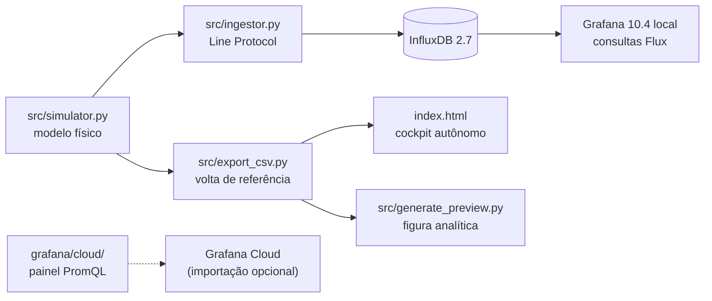

<div align="center">

# 🏎️ Simulador de Telemetria Veicular e Stack de Séries Temporais

### Modelo físico, ingestão em InfluxDB e dashboards Grafana provisionados

[](https://telemetria-veicular-grafana.vercel.app)
[](https://www.influxdata.com)
[](https://www.docker.com)
[](#-aviso-a-telemetria-deste-projeto-é-simulada)

</div>

---

## ⚠️ Aviso: a telemetria deste projeto é simulada

**Não há veículo instrumentado, nem sensores físicos, nem volta gravada em pista.**

Todos os dados vêm de `src/simulator.py`, um modelo de cinemática e térmica que gera séries a
10 Hz sobre o traçado de Interlagos. O que o repositório demonstra é a **engenharia em volta do
dado**: modelo físico coerente, ingestão por Line Protocol, persistência em banco de séries
temporais, dashboards provisionados e visualização autônoma no navegador.

---

## O que é real e o que é simulado

| Camada | Componente | Status |
| :--- | :--- | :--- |
| Modelagem | Cinemática, dinâmica lateral, térmica e GPS (`src/simulator.py`) | **Código real, saída sintética** |
| Ingestão | InfluxDB Line Protocol, streaming e carga em lote (`src/ingestor.py`) | **Real** |
| Persistência | InfluxDB 2.7 em contêiner | **Real** |
| Dashboard local | Grafana 10.4 com consultas Flux ao InfluxDB (`grafana/dashboards/`) | **Real** |
| Painel Grafana Cloud | JSON do painel público, séries geradas por funções PromQL (`grafana/cloud/`) | **Versionado, séries sintéticas** |
| Cockpit web | `index.html` lendo uma volta exportada (`telemetry_data.js`) | **Real** |
| Geometria | Pontos de referência do traçado; comprimentos e raios estimados | **Aproximada** |
| Valores dos sensores | Pressão, temperaturas, rotação, G, acelerador, freio | **Simulados** |

---

## Demonstração


**Figura 1.** Cockpit web: tacômetro e *shift lights*, marcha e velocidade, acelerador e freio,
monitor térmico, mapa do traçado com marcador móvel e diagrama G-G, reproduzindo a volta simulada
a 10 Hz. Tempo de volta, velocidade máxima e duração são calculados a partir do próprio arquivo de dados.


**Figura 2.** Composição analítica da mesma volta, gerada por `src/generate_preview.py`.

### Volta de referência (saída do modelo)

| Grandeza | Valor |
| :--- | :--- |
| Tempo de volta | 1:47,4 (1.074 amostras a 10 Hz) |
| Velocidade máxima | 246,6 km/h |
| Aceleração lateral máxima | 1,97 g |
| Desaceleração máxima | 1,30 g |
| Óleo | 98,7 a 101,8 °C · 3,37 a 5,59 bar |

Esses números **não são calibrados contra nenhum carro real**. Eles saem da combinação entre as
velocidades-alvo, os comprimentos e raios estimados dos setores e os limites de aceleração abaixo,
e servem para mostrar que as grandezas são coerentes entre si.

---

## Modelo físico

O traçado é dividido em 13 setores (`src/config.py`), com comprimento somando os 4.309 m oficiais,
velocidade-alvo, marcha e, nas curvas, raio médio e sentido. A cada passo `dt = 0,1 s`:

**Posição por distância percorrida.** `s += v·dt`; o setor avança quando `s` excede o comprimento,
e a volta fecha ao voltar ao primeiro setor. O tempo de volta é consequência, não parâmetro.

**Dinâmica longitudinal.** A velocidade persegue a velocidade-alvo do setor. Quando o setor seguinte
é mais lento, o alvo começa a cair nos últimos 40 % de uma reta ou 50 % de uma curva (zona de
frenagem). A pressão de freio é proporcional ao erro de velocidade, o que evita pulsar entre freio
e acelerador. Tração limitada a 5 m/s² e frenagem a 12,5 m/s², e a aceleração longitudinal é
derivada da própria variação de velocidade:

$$G_{long} = \frac{\Delta v}{\Delta t \cdot g}$$

**Dinâmica lateral.** Nas curvas, com raio médio $R$ do setor:

$$G_{lat} = \pm\frac{v^2}{R \cdot g}$$

**Motor.** Rotação proporcional à velocidade na marcha usada no setor.

**Térmica de primeira ordem.** Óleo e água respondem à carga $L = (\text{rpm}/12000)\cdot(\text{TPS}/100)$:

$$\frac{dT}{dt} = \frac{T_{eq}(L) - T}{\tau}, \qquad T_{eq}^{óleo} = 90 + 28L,\ \tau_{óleo} = 45\ \text{s}; \qquad T_{eq}^{água} = 85 + 9L,\ \tau_{água} = 30\ \text{s}$$

**Lubrificação.** Pressão crescente com a rotação, reduzida pela perda de viscosidade do óleo quente
e limitada a 5,9 bar pela válvula de alívio:

$$p = \left(1{,}8 + 3{,}8\cdot\frac{\text{rpm}}{12000}\right)\left(1 - 0{,}0035\,(T_{óleo} - 90)\right)$$

A semente do gerador de ruído é fixa, então a volta exportada é reprodutível.

---

## Especificação de instrumentação para uma versão física

Esta tabela **não descreve hardware existente**. É a especificação para substituir o simulador por
aquisição real, mantendo o restante do pipeline intacto.

| Grandeza | Sensor adequado | Faixa | Sinal |
| :--- | :--- | :---: | :---: |
| Pressão de óleo | Transdutor piezoresistivo 1/8" NPT | 0 – 10 bar | 0,5 – 4,5 V |
| Temperatura de óleo | Termistor NTC de imersão ou termopar tipo K | −20 a 150 °C | Resistivo / mV |
| Temperatura de água | NTC rosca M12×1,5 | 0 a 130 °C | Resistivo |
| Rotação | Roda fônica 60-2 com sensor indutivo ou Hall | 0 – 14.000 rpm | Onda quadrada |
| Posição de borboleta | Potenciômetro rotativo de eixo duplo | 0 – 100 % | 0 – 5 V |
| Aceleração | IMU MEMS de 6 eixos | ±16 g | I²C / SPI |
| Geolocalização | Módulo GNSS u-blox NEO-M8N com antena ativa | 10 Hz | NMEA / UBX |

---

## Arquitetura



Três trilhas: a **stack local** (simulador, InfluxDB e Grafana com dashboard Flux provisionado), o
**cockpit autônomo** em HTML sem infraestrutura (publicado na Vercel), e um **painel para Grafana
Cloud** versionado em `grafana/cloud/telemetria_publica_promql.json`. Esse painel não lê o InfluxDB:
suas séries são geradas por funções trigonométricas em PromQL, documentadas painel a painel. O link
público deixou de ser divulgado porque instâncias gratuitas do Grafana Cloud hibernam e exigem
interação antes de carregar; o JSON pode ser importado em qualquer instância.

---

## Execução

### Stack completa com Docker

```bash
docker compose up -d
pip install -r requirements.txt

python -m src.ingestor --mode backfill --points 3000   # carga imediata de ~5 min de sessão
python -m src.ingestor --mode stream                   # streaming contínuo a 10 Hz
```

Grafana em `http://localhost:3000` (dashboard **Telemetria Veicular Simulada · InfluxDB local**,
provisionado automaticamente) e InfluxDB em `http://localhost:8086`.

> As credenciais em `docker-compose.yml` são de desenvolvimento local e estão versionadas de
> propósito, para que a stack suba sem configuração. Não reutilize esses valores fora deste ambiente.

### Cockpit autônomo, sem Docker

```bash
python run_dashboard.py     # ou, no Windows, dois cliques em iniciar_telemetria.bat
```

### Regenerar a volta de referência e a figura

```bash
python -m src.export_csv         # data/sample_lap_interlagos.csv e telemetry_data.js
python src/generate_preview.py   # telemetria_dashboard_preview.png
```

---

## Estrutura

```text
telemetria-veicular-grafana/
├── src/
│   ├── config.py            # setores do traçado: comprimento, raio, alvo, marcha
│   ├── simulator.py         # modelo físico
│   ├── ingestor.py          # streaming e carga em lote para o InfluxDB
│   ├── export_csv.py        # exporta a volta de referência
│   └── generate_preview.py  # figura analítica
├── grafana/
│   ├── provisioning/        # datasource InfluxDB e auto-loader
│   ├── dashboards/          # dashboard local em Flux
│   └── cloud/               # JSON do painel público (PromQL)
├── data/                    # volta de referência em CSV
├── index.html               # cockpit web autônomo
├── telemetry_data.js        # volta de referência embutida
├── docker-compose.yml       # InfluxDB 2.7 + Grafana 10.4
└── run_dashboard.py         # servidor local do cockpit
```

---

## Próximos passos

1. **Aquisição física.** Substituir `simulator.py` por leitura serial ou CAN, mantendo a interface do
   `ingestor`.
2. **Calibração.** Ajustar raios, limites de aceleração e constantes de tempo térmicas contra
   telemetria pública de um carro real.
3. **Retenção e *downsampling*.** Políticas no InfluxDB para sessões longas.
4. **Alertas.** Regras no Grafana para queda de pressão de óleo e excesso de temperatura.

---

## Autor

**Lucas Fischer Paez** · Engenharia Mecânica, Instituto Mauá de Tecnologia
[GitHub](https://github.com/f1scher01) · [LinkedIn](https://www.linkedin.com/in/lucasfischerpaez)

Licença MIT.
